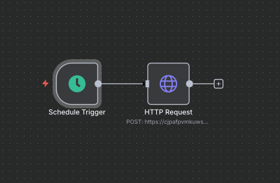

# 🧠 KeyCore Supabase Health Monitor

Monitoramento simples e automático do **Supabase** com **Edge Function** e **n8n**, mantendo seu projeto sempre sob vigilância pela **Keyla IA da KeyCore**.

## 🚀 Visão Geral

O fluxo executa **1 vez por dia**, chamando uma função `health` no Supabase para confirmar que o serviço está ativo.  
O **n8n** faz uma requisição HTTP para essa função e registra o resultado.

```text
n8n (Trigger diário)
   ↓
HTTP Request → Supabase Edge Function (/health)
   ↑
Retorna { status: "ok", message: "Supabase Edge Function ativa", timestamp }
```


## 🧩 1. Criando a função health no Supabase
	1.	Acesse o Dashboard do Supabase.
	2.	Vá até Edge Functions → clique em New Function.
	3.	Dê o nome health.
	4.	Cole o código abaixo no editor:
```text
// supabase/functions/health/index.ts
import { serve } from "https://deno.land/std@0.168.0/http/server.ts"

serve((_req) => {
  return new Response(
    JSON.stringify({
      status: "ok",
      message: "Supabase Edge Function ativa",
      timestamp: new Date().toISOString()
    }),
    {
      headers: { "Content-Type": "application/json" },
    },
  )
})
```
	5.	Clique em Deploy.
	6.	Copie a URL pública gerada, algo como:
```text
https://<PROJECT_REF>.functions.supabase.co/health
```
🔍 Teste rápido no terminal
```text
curl https://<PROJECT_REF>.functions.supabase.co/health
```
Você deve receber:
```text
{
  "status": "ok",
  "message": "Supabase Edge Function ativa",
  "timestamp": "2025-11-02T12:34:56.789Z"
}
```


## ⚙️ 2. Configurando o n8n

Arquivo de fluxo: workflow.json

	1.	Abra o painel do n8n.
	2.	Vá em Workflows → Import e envie o arquivo workflow.json.
	3.	Se quiser criar do zero:
	•	Adicione um Schedule Trigger configurado para executar 1x por dia
	•	Mode: Every Day
	•	Time: 09:00
	•	Adicione um HTTP Request Node
	•	Method: GET
	•	URL: https://<PROJECT_REF>.functions.supabase.co/health
	•	Response Format: JSON
	•	Conecte o Schedule Trigger → HTTP Request
	•	Salve o workflow


## ⏰ 3. Gatilho diário

O Schedule Trigger executa automaticamente o fluxo uma vez por dia, chamando sua função health e garantindo que o Supabase está respondendo.
```text

┌────────────────┐       GET               ┌────────────────────────────────────────────┐
│ n8n Scheduler  │ ────────────────▶      │ Supabase Edge Function: /health            │
│ 1x por dia     │                        │ Retorna { status, message, timestamp }     │
└──────┬─────────┘       JSON             └────────────────────────────────────────────┘
       │
       ▼
┌────────────────┐
│ HTTP Request   │
│ Verifica status│
└────────────────┘
```


## 🧠 4. Mensagem da Keyla IA

Olá, eu sou a Keyla, sua IA da KeyCore!
Detectei que o Serviço X está offline.
Acesse http://supabase.com para verificar o problema.
Assim que o serviço voltar, eu aviso! 🤖


🧩 5. Estrutura do Projeto
```text
keycore-supabase-monitor/
├── supabase/
│   └── functions/
│       └── health/
│           └── index.ts
├── n8n/
│   └── workflow.json
└── README.md
```


## ✅ 6. Benefícios
	•	Verificação automática e diária
	•	Notificações via n8n (e-mail, Slack, Telegram etc)
	•	Código simples e sem dependências externas
	•	Monitoramento contínuo do Supabase


## 🖼️ 7. Visual simples




## 🧾 8. Observações
	•	Você pode ajustar o intervalo do Schedule Trigger conforme a necessidade
	•	Para segurança, adicione autenticação Bearer Token na função
	•	É recomendável armazenar tokens e URLs nas credenciais seguras do n8n


Feito com 💙 pela Keyla IA da KeyCore

